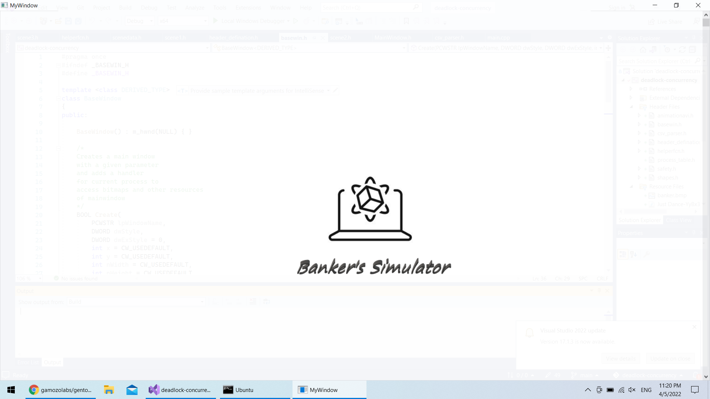
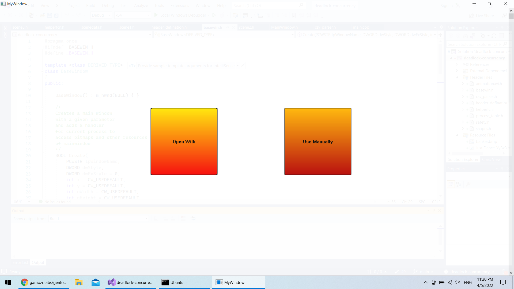
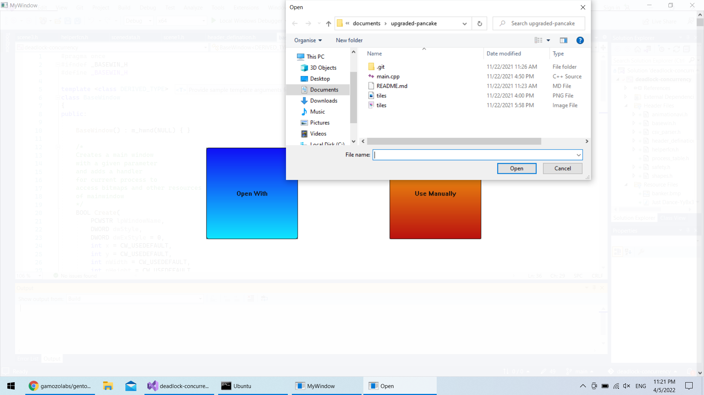
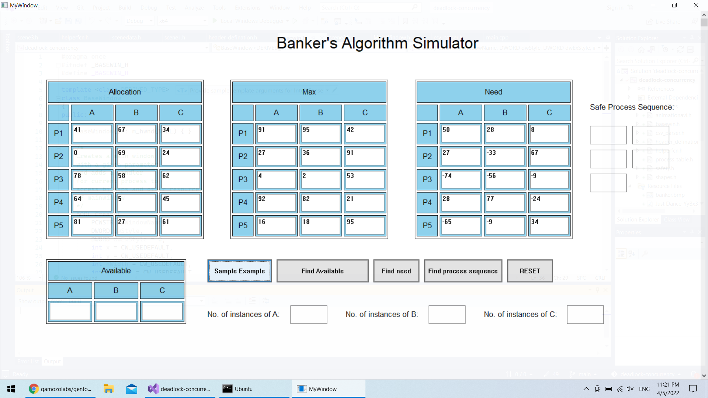

# Deadlock Concurrency with Banker's Algorithm

Deadlock Concurrency with Banker's Algorithm is a repository containing examples and resources related to dealing with deadlocks in concurrent programs, with a specific focus on the Banker's algorithm. Deadlocks occur when two or more threads are unable to proceed because each is waiting for the other to release a resource they need. The Banker's algorithm is used to prevent deadlocks and ensure a safe allocation of resources to processes.

## Table of Contents

- [Introduction](#introduction)
- [Features](#features)
- [Banker's Algorithm](#bankers-algorithm)
- [Usage](#usage)
- [Examples](#examples)
- [Contributing](#contributing)
- [License](#license)

## Introduction

Concurrent programming is becoming increasingly prevalent in modern software development to take advantage of multi-core processors and improve system performance. However, concurrent programs can be prone to deadlocks, which can lead to application failures and unpredictable behavior.

The Deadlock Concurrency with Banker's Algorithm repository addresses these challenges by offering sample code, documentation, and best practices for understanding and managing deadlocks in concurrent programs. The Banker's algorithm ensures that resources are allocated safely to processes, preventing deadlocks from occurring.

## Features

- Code examples showcasing various deadlock scenarios.
- Documentation on how to identify potential deadlocks in your code.
- Implementation and explanation of the Banker's algorithm for deadlock prevention.
- Strategies for handling resource allocation and detecting unsafe states.

## Banker's Algorithm

The Banker's algorithm is a resource allocation algorithm used to prevent deadlocks in concurrent systems. It ensures that resources are allocated in a safe manner, avoiding situations that could lead to deadlocks. In this repository, we provide a detailed explanation of the Banker's algorithm and its implementation in Cpp.

## Usage

To use the resources in this repository, you can either clone the entire repository or browse the specific files you are interested in. The code examples are written in Cpp and can be run directly in your development environment.

## Examples

Here are some examples of scenarios covered in this repository:

1. **Resource Locking**: Demonstrates a simple case of deadlock where two or more threads contend for the same set of resources.

2. **Circular Dependency**: Shows how circular dependencies between threads can lead to deadlocks.

3. **Lock Ordering**: Discusses the importance of maintaining a consistent order while acquiring locks to avoid deadlocks.

4. **Banker's Algorithm in Action**: Provides examples of applying the Banker's algorithm to prevent deadlocks in resource allocation.

## Contributing

Contributions to Deadlock Concurrency with Banker's Algorithm are welcome! If you have any ideas, bug fixes, or new examples related to deadlocks and the Banker's algorithm in concurrent programming, please feel free to open an issue or submit a pull request. Make sure to follow the repository's code of conduct and contribution guidelines.

## License

This project is licensed under the [MIT License](LICENSE), which allows you to use, modify, and distribute the code for both commercial and non-commercial purposes. See the `LICENSE` file for more details.

---

Thank you for your interest in Deadlock Concurrency with Banker's Algorithm! We hope this repository helps you gain a deeper understanding of concurrent programming, the challenges of deadlocks, and how the Banker's algorithm can be used to prevent them. If

